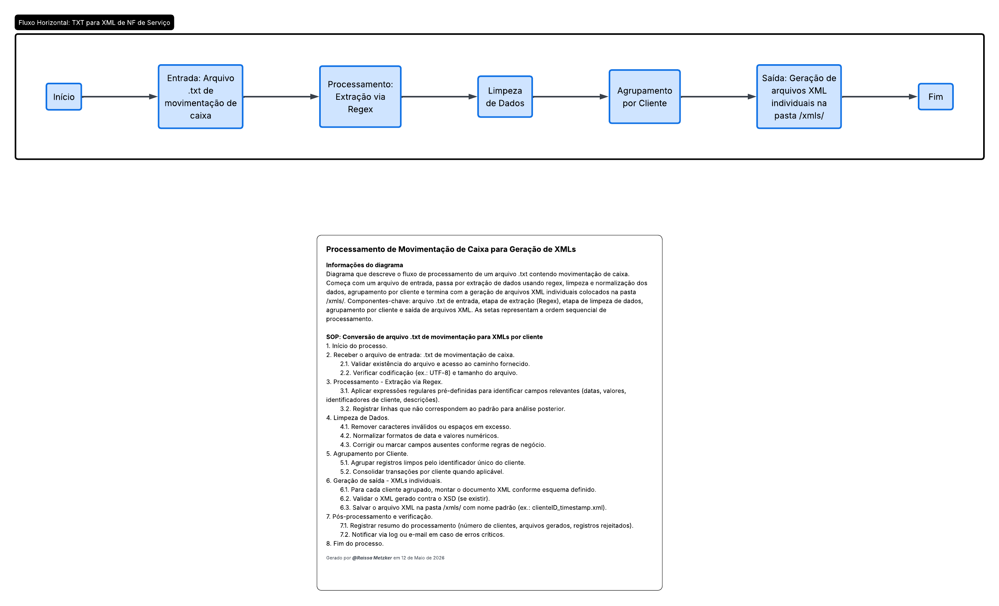

# Automação de Extração Fiscal: TXT para XML (Padrão GovDigital) 📑🐍

## 📌 Sobre o Projeto
Este projeto foi desenvolvido para solucionar um gargalo operacional real: a emissão manual de Notas Fiscais de Serviço (NFSe). O sistema automatiza a leitura de arquivos de movimentação de caixa (formato `.txt`) gerados pelo software **Fórmula Certa**, processa os dados e gera arquivos `.xml` prontos para importação no sistema **GovDigital**.

A solução foca em **eficiência operacional**, transformando um processo que levava minutos de digitação manual em uma execução de milissegundos, eliminando erros de transcrição de dados.

## 🛠️ Tecnologias e Ferramentas
*   **Linguagem:** Python 3.10+
*   **Bibliotecas Utilizadas:** 
    *   `xml.etree.ElementTree`: Para a construção estruturada do XML.
    *   `re` (Regex): Para extração e validação de padrões (CPFs e Valores).
    *   `datetime` & `random`: Para geração de chaves de controle únicas.
*   **Modelagem de Processos:** BizAgi Modeler (BPMN 2.0).

## 🔍 Visão de QA e Análise de Sistemas
Como estudante de ADS com foco em **Qualidade (QA)**, o código foi desenvolvido priorizando a integridade dos dados:
- **Agrupamento por Cliente:** O script identifica múltiplas vendas para o mesmo CPF no arquivo de origem e as consolida em itens dentro de um único XML, otimizando a emissão.
- **Sanitização de Dados:** Tratamento automático de separadores decimais e limpeza de strings para evitar rejeições no servidor fiscal.
- **Geração de Correlação Única:** Implementação de lógica para garantir que cada RPS tenha um identificador exclusivo, prevenindo erros de duplicidade.

## 🤖 Desenvolvimento Assistido por IA
Este projeto utilizou Inteligência Artificial para a aceleração do desenvolvimento da estrutura base e prototipagem de expressões regulares. 
A **curadoria técnica**, refatoração lógica, tratamento de exceções e a conformidade com as regras de negócio e normas fiscais municipais foram realizadas manualmente, garantindo a segurança e a precisão técnica da solução final.

## 📊 Fluxo do Processo (BPMN)
O diagrama abaixo, modelado no Lucidchart, detalha a lógica de automação:


*(Nota: O fluxo mapeia desde a leitura do .txt até a geração do arquivo na pasta /xmls)*

## 🚀 Como Executar
1. Certifique-se de ter o Python instalado em sua máquina.
2. Coloque o arquivo de movimentação (`.txt`) na pasta raiz do projeto.
3. No terminal, execute:
   ```bash
   python nome_do_arquivo.py


